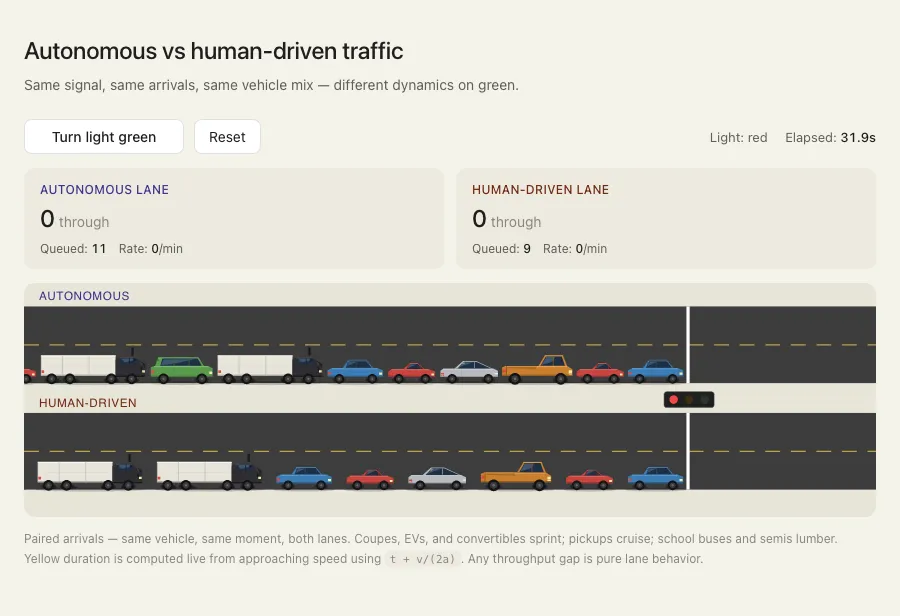

# Autonomous vs human-driven traffic simulation

An interactive in-browser simulation comparing vehicle throughput at a signalized intersection. Two lanes receive identical vehicle arrivals and the same signal — the only difference is whether the cars coordinate via vehicle-to-vehicle (V2V) communication or react sequentially with realistic human delays.

**[Try it live](https://sivaprasadakasam.github.io/TrafficSim/)**



## What it shows

When a light turns green, human drivers don't all start at once. The lead driver reacts in roughly one second. The next driver waits to see them move, then reacts. By the time the wave reaches the back of the queue, the light may already be yellow again.

Autonomous vehicles sharing intent over V2V can release together, with much tighter following gaps. The simulation visualizes this difference using the standard Intelligent Driver Model (IDM) for car-following, with realistic per-vehicle-type acceleration profiles.

Press **Turn light green** to release the queue. Watch the autonomous lane clear as a coordinated platoon while the human lane cascades. Press **Turn light red** to trigger a yellow phase (duration computed from approaching speed via the dilemma-zone formula `t + v/(2a)`) followed by red, and watch the queues build again.

## Parameters

The simulation uses these parameters, set in the source:

| Parameter | Autonomous | Human |
|---|---|---|
| Reaction time | 0.15 s (all cars simultaneously) | 1.0 s lead + 0.55 s cascading per car |
| Acceleration multiplier | 2.6× human baseline | 1.0× baseline |
| Time headway (gap) | 0.35 s | 1.5 s |
| Minimum gap | 5 m | 14 m |

Per-vehicle multipliers (applied on top of lane parameters):

| Vehicle | Acceleration | Top speed |
|---|---|---|
| Sport coupe | 1.3× | 1.0× |
| Sedan | 1.0× | 1.0× |
| EV sedan | 1.5× | 1.05× |
| Convertible | 1.2× | 1.0× |
| Minivan | 0.8× | 0.95× |
| Pickup | 0.85× | 1.0× |
| School bus | 0.5× | 0.85× |
| Semi truck | 0.4× | 0.88× |

These are tunable — feel free to fork and adjust.

## Running locally

No build step. Clone the repo and open `index.html` in a browser.

```bash
git clone https://github.com/sivaprasadakasam/TrafficSim.git
cd TrafficSim
open index.html  # or just double-click the file
```

## Forking and modifying

Common things to experiment with:

- Change reaction times to see how sensitive throughput is to driver attention
- Add more vehicle types (motorcycles, e-bikes, autonomous shuttles)
- Vary the arrival rate to model rush hour vs off-peak
- Add a second intersection downstream to see green-wave coordination effects
- Plot the throughput as a graph instead of a counter

The whole simulation is one self-contained `index.html` file — open it in any text editor and you'll find the physics in a single `<script>` block at the bottom.

## Background

The car-following physics use the [Intelligent Driver Model](https://en.wikipedia.org/wiki/Intelligent_driver_model) (Treiber, Hennecke, Helbing 2000), the standard model in microscopic traffic simulation. The cascading-reaction delay for the human lane is calibrated to typical values found in driver-behavior literature (lead reaction ~1 s, follow-on reactions ~0.5 s per car back).

V2V coordination has been a working spec since DSRC was standardized in the early 2010s, and more recent C-V2X (cellular V2X) is being deployed in newer vehicles. The simulation idealizes this as instantaneous shared-state coordination — real V2V has latency and packet loss, so actual gains would be somewhat smaller than shown here.

## License

MIT — see [LICENSE](LICENSE). Use this however you'd like.

## Contributing

Pull requests welcome. Some areas where improvements would be especially valuable:

- Calibrating parameters against published intersection throughput data
- Adding mobile touch support and responsive layout improvements
- Adding accessibility features (keyboard controls, screen reader support)
- Implementing partial-V2V scenarios (mixed fleets of autonomous + human)
